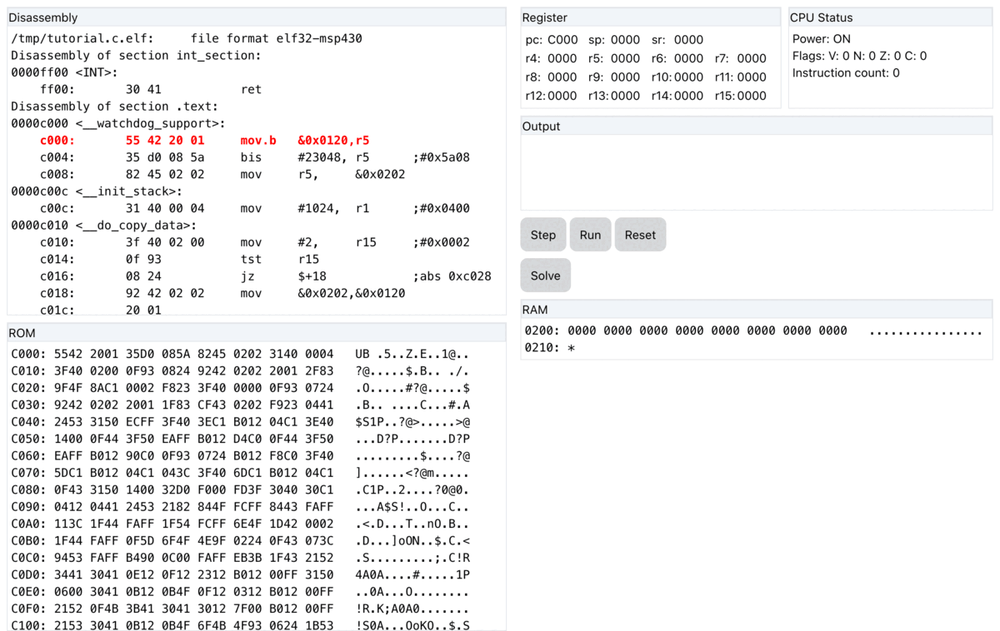

# Elixir CTF Game

## Summary
This is an attempt to reimplement the famous [Embedded Security CTF game](https://microcorruption.com/) in Elixir, using Phoenix and Liveview framework.

Play it live here: https://elixir-ctf.gigalixirapp.com

## Emulator
The emulator for the RISC CPU core of MSP430 is written in pure Elixir, following chapter 1 & 3 of the spec at https://www.ti.com/lit/ug/slau049f/slau049f.pdf

See the code in [lib/elixir_ctf/domain](lib/elixir_ctf/domain/) for more details.

## C code
The C code files for the lock are in [priv/level_data](priv/level_data) (there are only 4 levels right now). They are compiled using gcc-msp430 to produce hex and objdump files. See [priv/level_data/build.sh](priv/level_data/build.sh) for more details.

## UI
The main UI is built using [LiveView](https://hexdocs.pm/phoenix_live_view/Phoenix.LiveView.html). Most of the code is in [lib/elixir_ctf_web/controllers/level_play_live.ex](lib/elixir_ctf_web/controllers/level_play_live.ex)

## Screenshot

